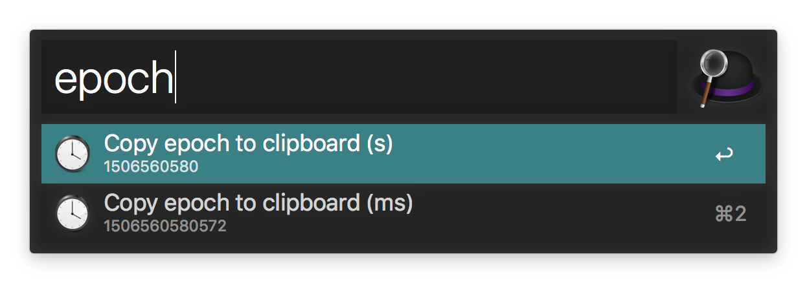
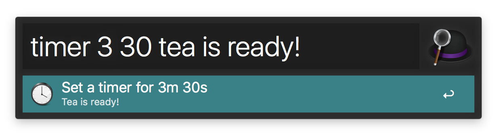
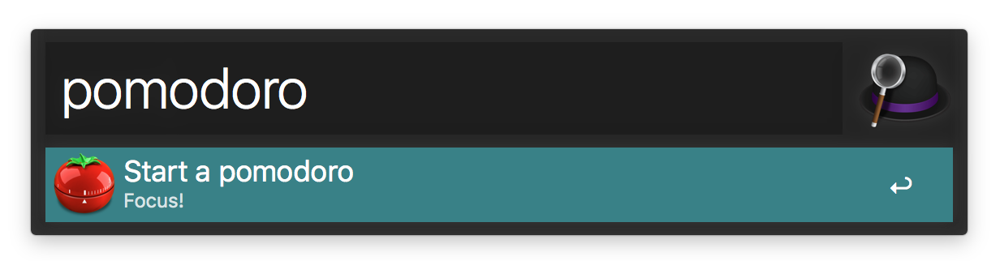

# alfred-workflows
A collection of [workflows](https://www.alfredapp.com/help/workflows/) for [Alfred](https://www.alfredapp.com).

## epoch
Copies epoch times to clipboard.

Support seconds and milliseconds format.

## timer

Allows to set timers, shows notification and chimes when they expire.

It has support for the pomodoro technique.

Use it as a template for adding your own custom timer keywords.

## ihm

Fast navigation to somecompany's websites.

Uses keyword based fuzzy search.
