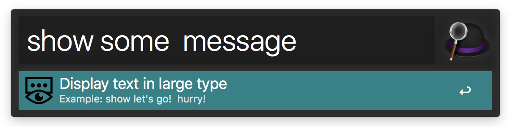
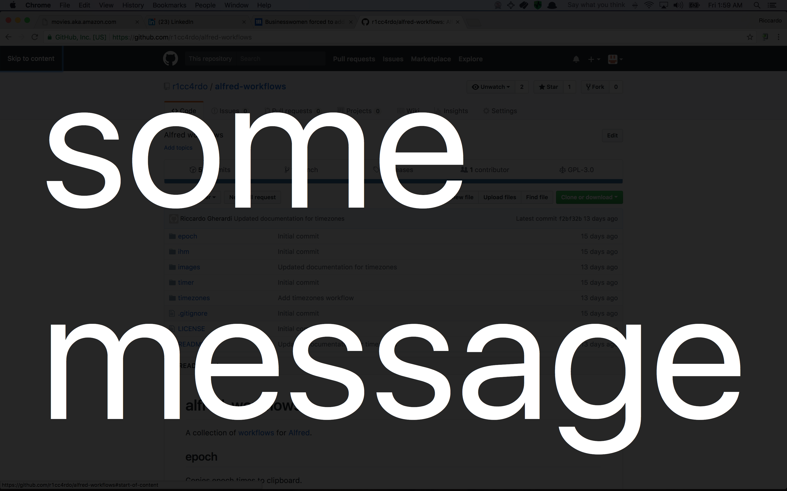
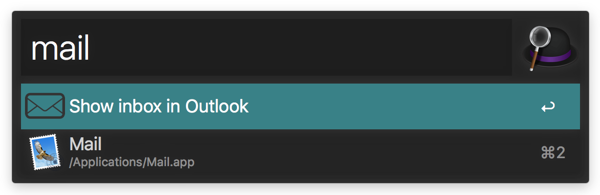
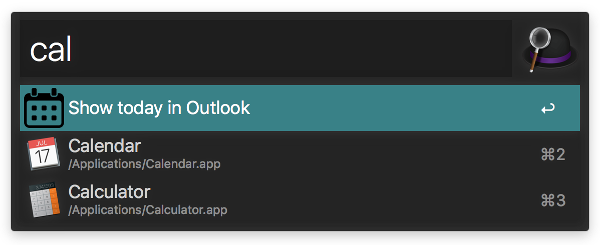
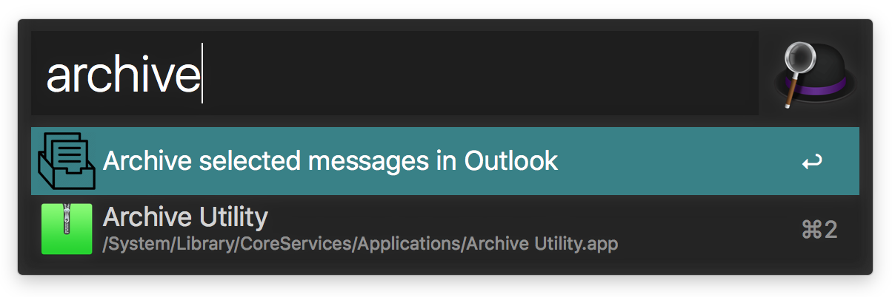

# alfred-workflows
A collection of [workflows](https://www.alfredapp.com/help/workflows/) for [Alfred](https://www.alfredapp.com).

## epoch
Copies epoch times to clipboard.

Support seconds and milliseconds format.

## timer

Allows to set timers, shows notification and chimes when they expire.

It has support for the pomodoro technique.

Use it as a template for adding your own custom timer keywords.

## timezones

Show world timezones.

Does not require an internet connection.

Add your timezones to a personalized shorlist:

The workflow relies on the the PyTZ library. It comes with its own copy, but will use the one in your system if available.

## showtell

Messages as speech or large text.

results in:

Otherwise, opt for audio output:

## outlook

Shortcuts to mail and calendar view.

The archive command is bound to an hotkey, change it in the workflow.

## ihm

Fast navigation to somecompany's websites.

Uses keyword based fuzzy search.
